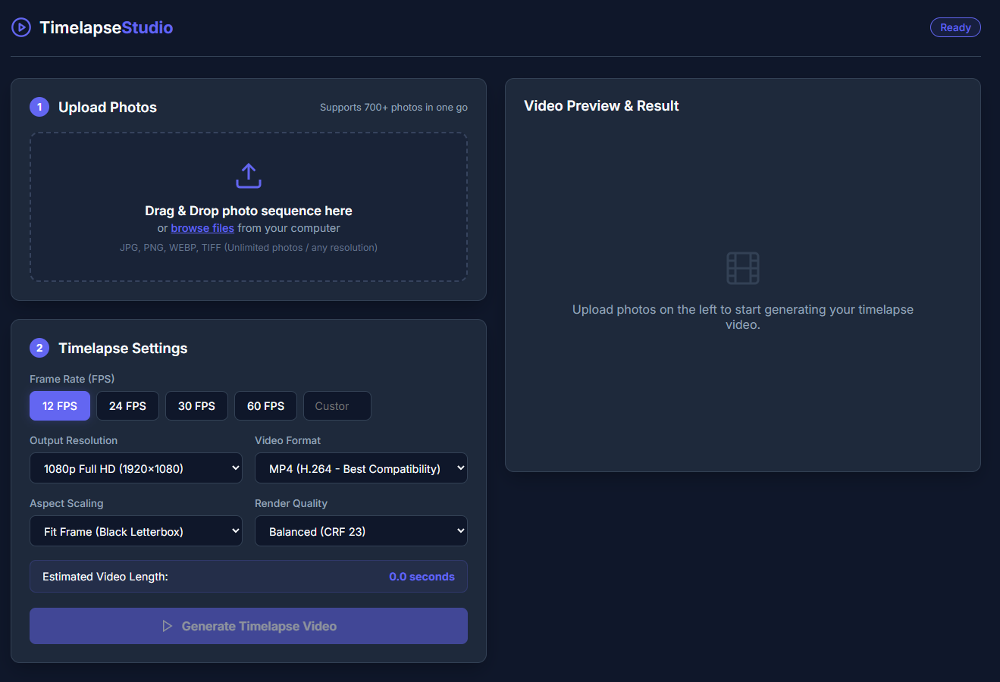

# Timelapse Studio

A web-based tool to create timelapse videos from a sequence of photos.



## Features
- **Massive Photo Sequences**: Effortlessly handles 3,000+ photos with adaptive chunking, automatic network retries, and cancellation controls.
- **Select Entire Folders**: Pick a whole directory using the folder browser button, drag and drop entire folders, or scan local directories on disk directly.
- **Direct Local Folder Mode**: Instantaneous loading for thousands of photos directly from your hard drive with zero upload wait and zero disk duplication.
- **Photo Sequence Verification**:
    - **Natural Sort Ordering**: Always sorts chronologically by original filename (oldest photo first, e.g., `IMG_0001` before `IMG_0002`).
    - **Visual Keyframe Filmstrip**: Live thumbnails showing the start (oldest), 25%, 50%, 75%, and end (newest) frames before rendering.
    - **Full Sequence Inspector**: Search and inspect the exact order of all photos across pages.
    - **Sort Order Toggle**: Switch between Oldest First (A → Z) and Newest First (Z → A).
- **Customizable Settings**:
    - Frame Rate (FPS)
    - Output Resolution (1080p, 4K, 720p, Original)
    - Aspect Scaling (Contain, Cover, Stretch)
    - Video Format (MP4, WebM)
    - Render Quality (High, Balanced, Fast)
- **Real-time Progress**: Watch the encoding progress with live status updates via SSE (Server-Sent Events).
- **Instant Preview**: View and download your generated timelapse immediately.

## Prerequisites
- **Node.js** (v14+ recommended)
- **FFmpeg** installed on your system and available in your PATH.

## Installation

1.  **Clone the repository:**
    ```bash
    git clone https://github.com/jaleks71/timelapse-studio.git
    cd timelapse-studio
    ```

2.  **Install dependencies:**
    ```bash
    npm install
    ```

3.  **Start the application:**
    ```bash
    npm start
    ```

4.  **Access the app:**
    Open your browser and navigate to `http://localhost:3000`.

## Usage
1.  **Choose your photos source**:
    - **Browser Upload**: Drag and drop photos or an entire folder, or click **"Select Photos"** / **"Select Folder"**.
    - **Local Folder on Disk** *(Recommended for 3,000+ photos)*: Switch to the **Local Folder on Disk** tab, paste the folder path, and click **"Scan Folder"** for instant loading.
2.  **Verify the photo sequence**:
    - Inspect the **Keyframe Preview Filmstrip** (Start, 25%, 50%, 75%, End) to verify that the oldest photo plays first.
    - Confirm the sort order is set to **Oldest First (A → Z)** (or click **Newest First** if needed).
    - Optionally click **"Inspect All Photos"** to search and view the full sequence list.
3.  **Adjust timelapse settings** (FPS, Resolution, Quality, Format).
4.  Click **"Generate Timelapse Video"**.
5.  Watch real-time frame encoding progress, then preview and download your video.

## Development & Testing

The `scripts/` directory contains utilities for local development and testing:

-   **Generate test photos:**
    ```bash
    node scripts/generate-700-photos.js
    ```
    Creates 700 BMP test frames in a `test_photos/` directory with smooth color-shifting gradients and a moving progress bar — useful for testing the full pipeline without needing real photos.

-   **Run end-to-end test:**
    ```bash
    node scripts/test-e2e.js
    ```
    Uploads all 700 generated test photos in batches and triggers two render passes (1080p @ 30 FPS and 4K @ 60 FPS), verifying that output videos are created successfully. Requires the server to be running.

## Technologies Used
- **Backend**: Node.js, Express, Multer, CORS
- **Frontend**: Vanilla JavaScript, HTML5, CSS3
- **Processing**: FFmpeg

## Credits & Dependencies
- [FFmpeg](https://ffmpeg.org/): Used for video encoding and processing.
- [Express](https://expressjs.com/): Web framework for the backend.
- [Multer](https://github.com/expressjs/multer): Middleware for handling multipart/form-data.
- [CORS](https://github.com/expressjs/cors): Middleware for enabling Cross-Origin Resource Sharing.

## Contributing

Contributions are welcome! If you have ideas for new features, spot a bug, or want to improve the documentation, feel free to:

1.  Fork the repository
2.  Create a feature branch (`git checkout -b feature/my-improvement`)
3.  Commit your changes (`git commit -m 'Add my improvement'`)
4.  Push to the branch (`git push origin feature/my-improvement`)
5.  Open a Pull Request

Bug reports and feature requests via [Issues](https://github.com/jaleks71/timelapse-studio/issues) are also appreciated!

## License
This project is licensed under the MIT License - see the [LICENSE](LICENSE) file for details.
# timelapse-studio
